# Locafy 
**Find Places. Connect Local.**

Locafy is a Flutter-based local business discovery application designed to help users discover businesses and places around them. Users can browse businesses by category, search for businesses, view business details, and communicate directly with business owners.

The project was built as a personal portfolio project to demonstrate practical Flutter development, Firebase integration, location-based functionality, and real-time communication.

## **Features**

- **User Authentication**
  - User registration and login
  - Firebase Authentication

- **Location-Based Discovery**
  - Uses the user's location to determine distance from businesses
  - Displays businesses based on local discovery

- **Business Discovery**
  - Browse businesses by category
  - Restaurants and cafés
  - Shops
  - Hotels
  - Apartments
  - Gyms and fitness

- **Business Search**
    - Search businesses by name
    - Case-insensitive search
    - Search history/recent searches

- **Business Details**
    - View business information
    - Business images
    - Ratings
    - Distance from the user
    - Contact/business interaction options

- **Real-Time Messaging**
    - Customers can chat with business owners
    - Real-time message updates using Firebase Firestore
    - Read/seen message status
    - Unread message counters
    - Conversation list showing the latest message

- **User Profiles**
    - User profile information
    - Username
    - Profile image

- **Responsive UI**
    - Clean and modern interface
    - Category-based navigation
    - Reusable Flutter widgets

## Tech Stack

### Frontend
   - Flutter
   - Dart

### Backend & Database
   - Firebase Authentication
   - Cloud Firestore
   
### Media Storage
   - Cloudinary

### Maps & Location
   - Geolocator
   - latlong2
   - OSRM (Open Source Routing Machine) Routing API
   - Flutter Map

### Networking
- Dio

### Development Tools
- Git
- GitHub
- VS Code
- Android Studio

## Architecture

Locafy follows a service/model-based structure to keep application logic separated from the UI.

    lib/ 
    ├── features/ 
    │ ├── screens/ 
    │ ├── services/
    │ ├── validators/
    │ └── helper/ 
    │ 
    ├── models/ 
    │ ├── business_model.dart 
    │ ├── chat.dart 
    │ └── message.dart 
    │ 
    ├── widgets/ 
    │ └── ... 
    │ 
    └── main.dart

The application uses models to represent application data and service classes to handle operations such as authentication, business queries, categories, search, and messaging.

## Firebase Structure

The application uses Cloud Firestore for storing application data.

    users/ 
       {userId}

    businesses/ 
       {businessId} 

    chats/ 
       {chatId} 
          messages/ 
             {messageId}

## Chat System

Each conversation is stored under a unique chat document, with individual messages stored in a messages subcollection.

The chat system keeps track of:

- Customer ID
- Business owner ID
- Last message
- Last message time
- Customer unread count
- Owner unread count
- Message sender
- Message receiver
- Message seen status

##  Getting Started

**Prerequisites**

Make sure you have the following installed:

- Flutter SDK
- Dart SDK
- Android Studio or VS Code
- A Firebase project
- A Cloudinary account configured for image uploads

## Installation

Clone the repository:

    git clone https://github.com/Barry3232/locafy
    cd locafy
    flutter pub get
    flutter run

## Screenshots

### Home Screen

  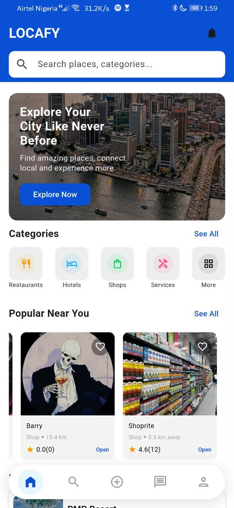
  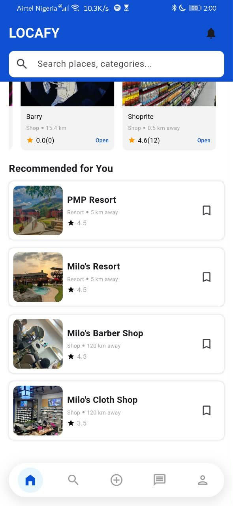

### Search

  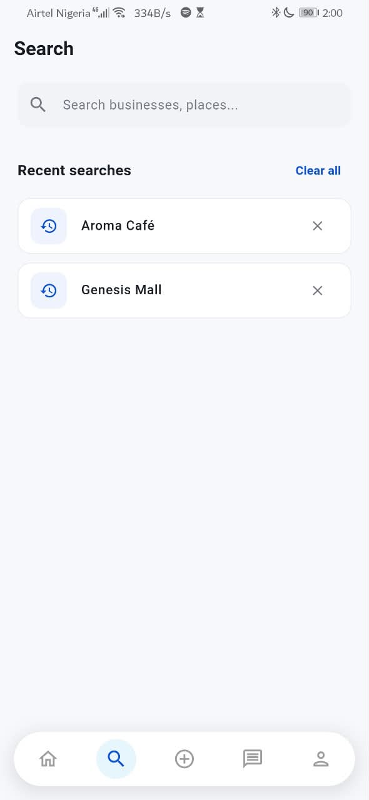
  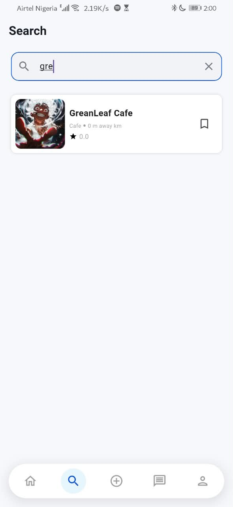

### Categories

  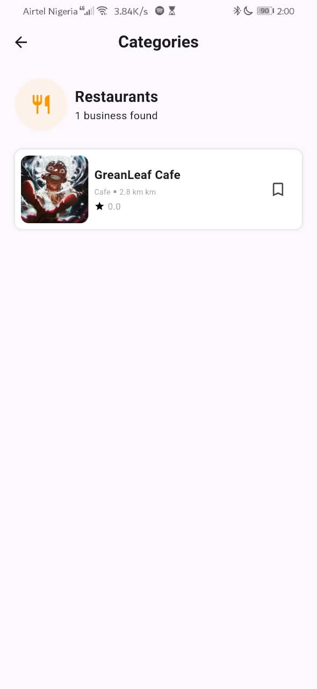
  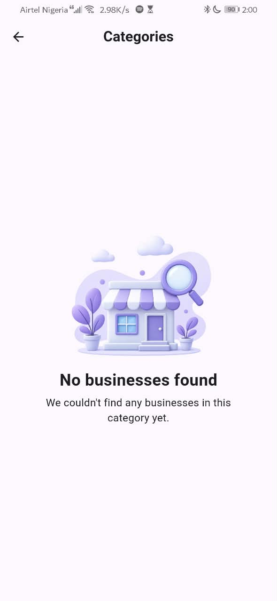
  

  ### Details

  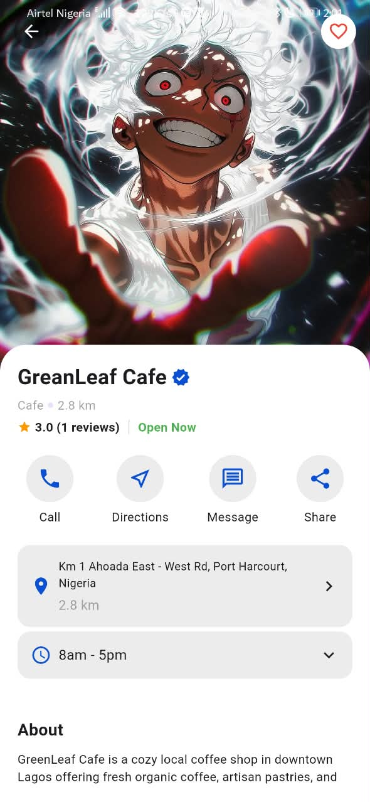
  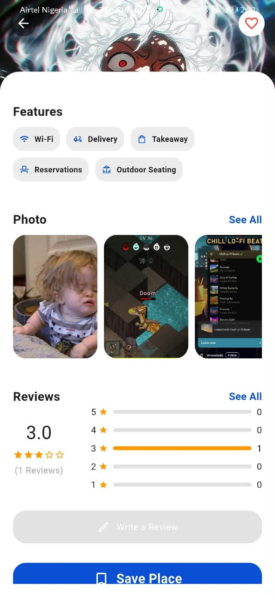
  

  ### Publish

  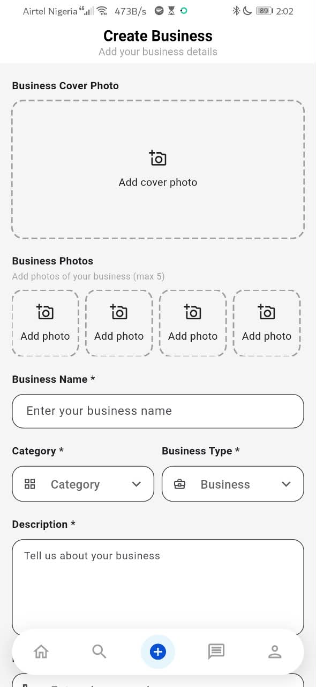
  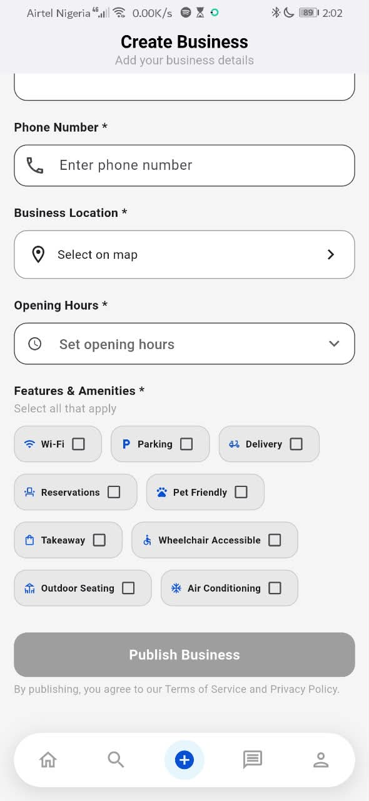
  

### Reviews

  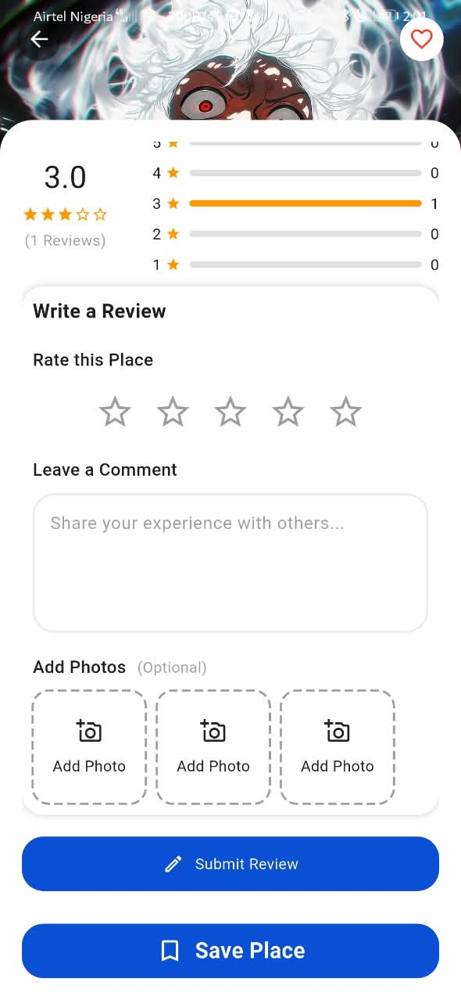
  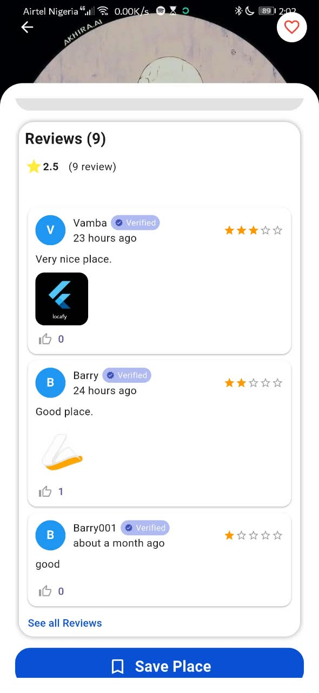
  

### Message

  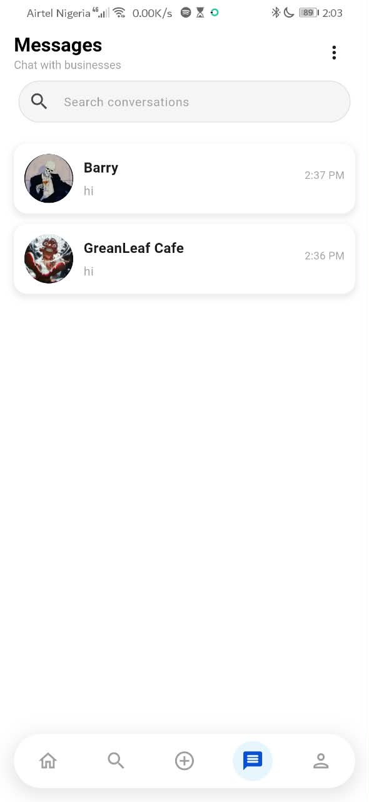
  

### Chat

  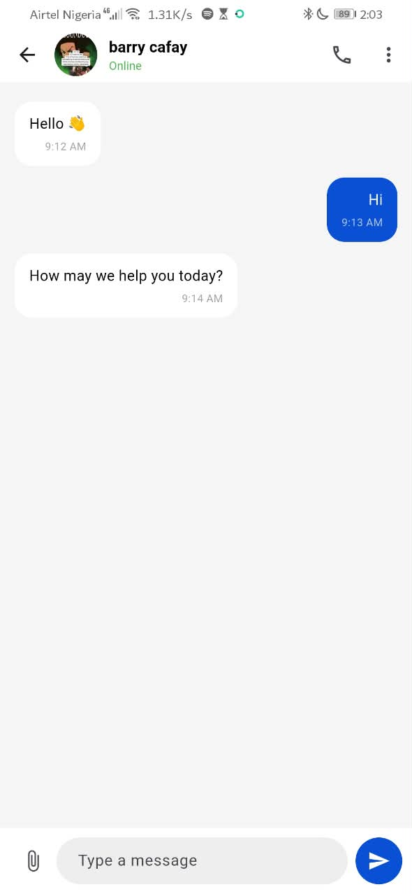
  

  ### Popular Businesses

  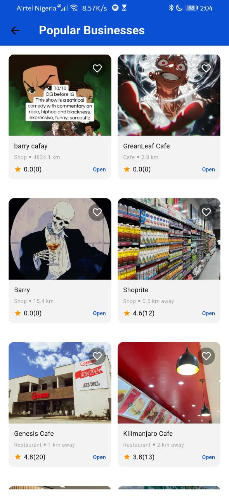
  

  ### Location & Navigation

  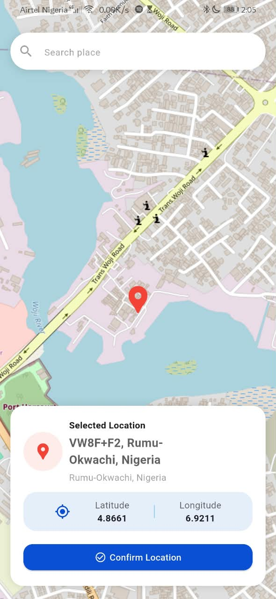
  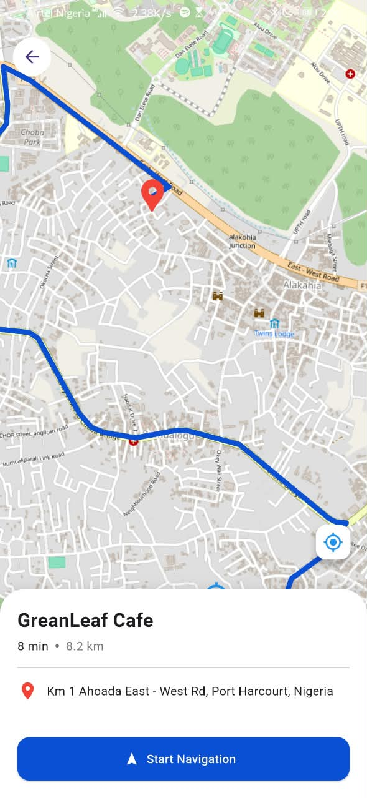
  

### Profile

  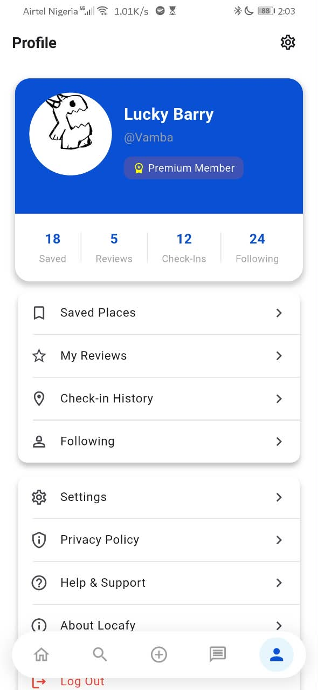
  

## What I Learned

Building Locafy provided practical experience with:

- Flutter and Dart development
- Building reusable UI components
- Firebase Authentication
- Cloud Firestore data modeling
- Real-time Firestore streams
- CRUD operations
- Location services and distance calculation
- Search implementation
- Real-time chat functionality
- Managing asynchronous operations with Future and Stream
- Working with Git and GitHub
- Debugging and resolving Flutter/Firebase issues
- Structuring application logic using models and services

## Future Improvements

Potential future improvements include:

- Advanced/fuzzy business search
- Business verification system
- Push notifications for new messages
- Improved business recommendations
- More advanced filtering and sorting
- Expanded business categories
- Settings functionalities
- Improved logic for popular and recommended businesses

## Author

**Barisuka Lucky Nganigo**

GitHub: https://github.com/Barry3232

Linkedin: https://linkedln.com/in/barisuka-nganigo-8b36a2333

Email: barryluck37@gmail.com

*Flutter Developer*

Locafy was developed as a personal project to explore real-world Flutter application development and Firebase integration.